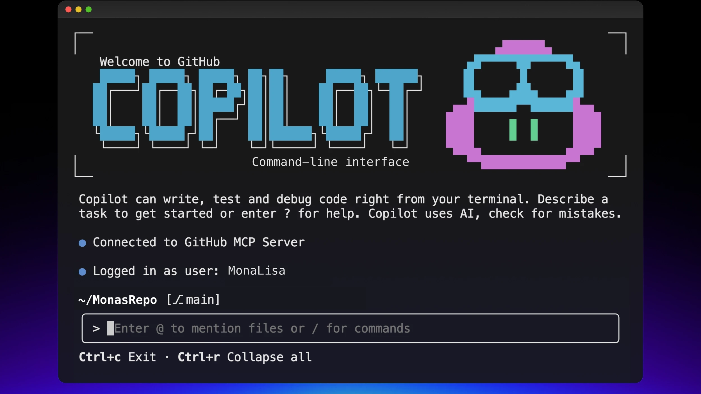

## Passo 1: Instalar o Copilot CLI e Usar o Modelo de Issue

Duck prefere trabalhar no terminal e quer usar IA a partir dele.
Duck está se preparando para desenvolver um novo aplicativo de calculadora CLI em Node.js e planeja instalar o Copilot CLI standalone para construir o aplicativo pelo terminal.

### 📖 Teoria: GitHub Copilot CLI - Um Aplicativo de Terminal Independente

#### O que é o GitHub Copilot CLI?

O GitHub Copilot CLI é um **aplicativo de terminal standalone** que traz o poder do GitHub Copilot diretamente para sua linha de comando. Ele é instalado via npm e oferece uma experiência interativa rica para desenvolvedores.



#### As principais capacidades e opções a serem conhecidas incluem:

- Fornece sugestões inteligentes de comandos com os modelos de IA mais recentes da OpenAI e Google
- Gera snippets de código e scripts diretamente no terminal
- Auxilia com operações do Git e interações com o GitHub
- Suporta entradas de imagens via colar e arrastar e soltar para contexto visual
- A flag `--enable-all-github-mcp-tools` habilita todas as ferramentas GitHub MCP (Model Context Protocol), dando ao Copilot CLI acesso a recursos do GitHub como criar issues, gerenciar repositórios e muito mais.
- Dependendo da configuração do Copilot CLI (por exemplo, se você não usar a opção `--allow-all`), pode ser solicitado que você habilite determinados recursos durante a sessão. Responda **sim** a esses prompts também.
- `/session`: Mostra detalhes sobre sua sessão de chat atual.
- `/context`: Fornece uma visão geral visual do seu uso atual de tokens
- `/usage`: Permite ver as estatísticas da sua sessão, incluindo:
  - A quantidade de requisições premium usadas na sessão atual
  - A duração da sessão
  - O total de linhas de código editadas
  - Um detalhamento do uso de tokens por modelo
- `/share [file|gist] [caminho]` - Compartilha a sessão em arquivo markdown ou GitHub gist
- Criação de **agentes personalizados** para codificar prompts e fluxos de trabalho especializados
- Delegação de tarefas ao **agente de codificação do Copilot** usando o comando `/delegate`

#### Atalhos globais

```text
 @             mencionar arquivos, incluir conteúdos no contexto
 Esc           cancelar a operação atual
 !             executar comando no shell local (ignorar Copilot)
 ctrl+c        cancelar operação / limpar entrada / sair
 ctrl+d        encerrar
 ctrl+l        limpar tela
 shift+tab     alternar entre o modo plano e o modo interativo regular
```

#### Requisitos de Instalação

Para instalar o Copilot CLI, você precisa de:

- Node.js versão 22 ou posterior
- npm versão 10 ou posterior
- Uma assinatura ativa do GitHub Copilot (Pro, Pro+, Business ou Enterprise)

#### Modelos de Issue

Os modelos de issue ajudam a manter a consistência quando membros da equipe criam issues. Este repositório já tem um modelo `feature_request.md` que você usará para criar sua issue do aplicativo de calculadora. Os modelos garantem:

- Que todas as informações necessárias sejam capturadas de antemão
- Que as issues sigam um formato padrão
- Que a equipe possa triagear e responder às issues com mais eficiência

#### Referências

- [Instalando o GitHub Copilot CLI](https://docs.github.com/en/copilot/how-tos/set-up/install-copilot-cli)
- [Usando o GitHub Copilot CLI](https://docs.github.com/en/copilot/how-tos/use-copilot-agents/use-copilot-cli)
- [GitHub Copilot CLI 101](https://github.blog/ai-and-ml/github-copilot-cli-101-how-to-use-github-copilot-from-the-command-line/)

> [!IMPORTANT]
> Se você reiniciou seu codespace, pode ser necessário executar `copilot --allow-all` e autenticar-se com o GitHub novamente executando `!gh auth login` no terminal,
> ou usar `!gh auth login` de dentro da sessão do Copilot CLI.

### :keyboard: Atividade 1: Conhecendo seu ambiente de desenvolvimento

1. Clique com o botão direito no botão abaixo para abrir a página **Criar Codespace** em uma nova aba.

   [](https://codespaces.new/{{full_repo_name}}?quickstart=1)
   - O nível gratuito do Codespaces que acompanha todas as contas GitHub é suficiente, assumindo que você ainda tem minutos disponíveis.
   - As configurações padrão do Codespace são adequadas.

> [!IMPORTANT]
> Este ambiente VS Code do Codespace foi simplificado para focar no uso do Copilot CLI no terminal. Você trabalhará principalmente com comandos do terminal em vez de usar o conjunto completo de recursos do VS Code.

1. Confirme que o campo **Repositório** é a sua cópia do exercício, não o original, e clique no botão verde **Criar Codespace**.
   - ✅ Sua cópia: `/{{full_repo_name}}`
   - ❌ Original: `/arilivigni/create-applications-with-the-copilot-CLI`

1. Aguarde um momento para o Visual Studio Code carregar.

1. Vamos focar na janela do terminal completa, pois tudo se trata do CLI.

### ⌨️ Atividade 2: Instalar o Copilot CLI Standalone

1. Abra seu Codespace (se ainda não estiver aberto)

1. Instale o GitHub Copilot CLI standalone executando no terminal:

   > 

   > ```bash
   > npm install -g @github/copilot
   > ```

1. Verifique a instalação executando:

   > 

   > ```bash
   > copilot --version
   > ```

> [!TIP]
> Após a instalação, você pode usar o comando `copilot` em qualquer lugar do seu terminal para iniciar uma sessão interativa!

### ⌨️ Atividade 3: Criar uma Issue Usando o Copilot CLI

1. Inicie uma sessão interativa do Copilot CLI:

   > 
   >
   > ```bash
   > copilot --enable-all-github-mcp-tools
   > ```

> [!NOTE]
> Ao iniciar o Copilot CLI, pode ser solicitado que você adicione esta pasta à lista de pastas confiáveis e configure as ligações de teclas. Responda **sim** a ambas as solicitações para continuar.


<br />


2. Autorize com o GitHub (se ainda não autenticado) no Copilot CLI:

   > 
   >
   > ```prompt
   > /login
   > ```

> [!NOTE]
> Após executar `!gh auth login`, você receberá um link e um código de autenticação. Clique no link para abrir o GitHub no navegador e insira o código para concluir o processo de autenticação.

3. Explore comandos úteis de barra no Copilot CLI:
   - Veja as informações da sua sessão atual:

     > 
     >
     > ```prompt
     > /session
     > ```

   - Veja as informações de contexto atual:

     > 
     >
     > ```prompt
     > /context
     > ```

   - Veja as informações de uso atual:

     > 
     >
     > ```prompt
     > /usage
     > ```

> [!NOTE]
>
> - `/session`: Mostra detalhes sobre sua sessão de chat atual.
> - `/context`: Fornece uma visão geral visual do seu uso atual de tokens
> - `/usage`: Permite ver as estatísticas da sua sessão, incluindo:
>   - A quantidade de requisições premium usadas na sessão atual
>   - A duração da sessão
>   - O total de linhas de código editadas
>   - Um detalhamento do uso de tokens por modelo

4. Peça ao Copilot CLI para ajudá-lo a criar uma issue de solicitação de funcionalidade para o aplicativo de calculadora:

   > 
   >
   > ```prompt
   > Crie uma issue no GitHub para um aplicativo de calculadora CLI em Node.js usando o modelo
   > .github/ISSUE_TEMPLATE/feature_request.md e certifique-se de que a issue esteja em
   > formato markdown contendo "calculator" no título e seguindo o formato do modelo de issue.
   > Quero solicitar uma funcionalidade para operações aritméticas básicas incluindo
   > - adição
   > - subtração
   > - multiplicação
   > - divisão
   > A calculadora deve ser implementada em calculator.js
   > Crie a issue diretamente no proprietário atual desta sessão
   > e no repositório em github.com usando os comandos `gh` CLI.
   > Liste o link da issue quando concluído
   > ```

5. Mona já deve estar verificando seu trabalho. Aguarde um momento e acompanhe os comentários. Você verá ela responder com informações de progresso e a próxima lição.

> [!NOTE]
> O Copilot CLI pode pedir confirmação para criar a issue e usar `gh issue` e `git config`.
> Responda **sim** para criar a issue e
> **"Sim, e aprove `gh issue` ou `git config` para o restante da sessão em execução"**.


<details>
<summary>Tendo problemas? 🤷</summary><br/>

- Certifique-se de ter o Node.js 22+ instalado: `node --version`
- Se o npm install falhar, tente: `sudo npm install -g @github/copilot`
- Certifique-se de ter acesso ao GitHub Copilot habilitado em sua conta
- Se a autenticação falhar, execute `copilot` e rode `!gh auth login`
- Você também pode criar a issue pela interface web do GitHub se necessário

</details>
